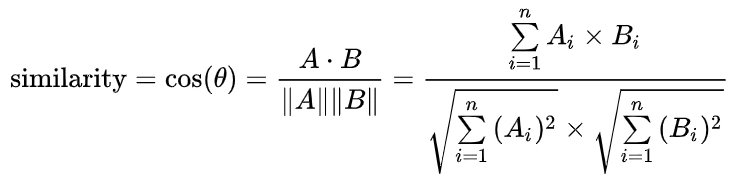

# cosine-similar

## description
使用词向量余弦算法计算文本相似度
### 分词
 [HanLP](https://github.com/hankcs/HanLP)
### 公式


## apply
```java
public class Main {

    public static void main(String[] args) {

        // 高度相似文本
        String text = "天气预报说，明天会下雨，你明天早上去上班的时候记得带上伞。";
        String target = "你明天早上去上班的时候记得带上伞，天气预报说的可能会下雨。";

        TextSimilarity textSimilarity = new TextSimilarity(text, target);
        double similarity = textSimilarity.compute();

        System.out.println(similarity);
    }
}
```
